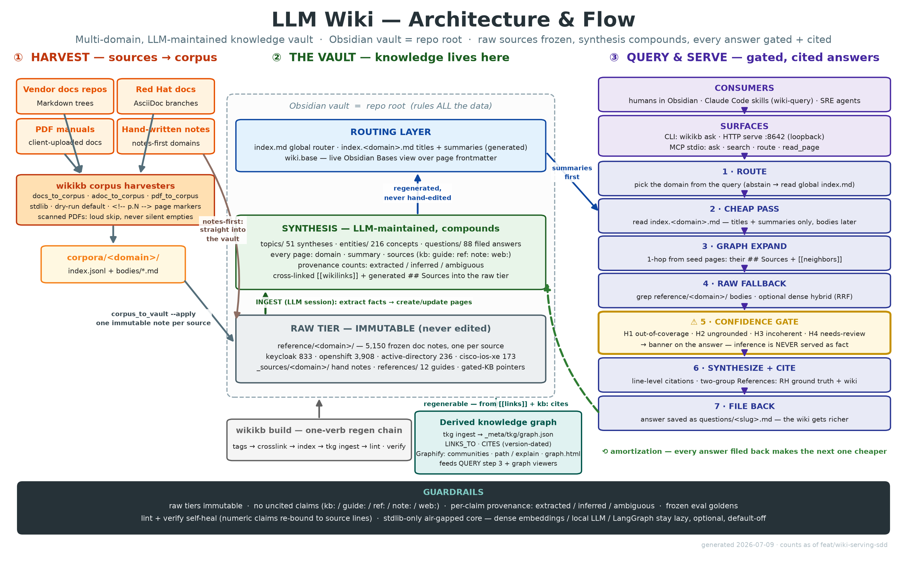

# llm-wiki — multi-domain LLM-maintained knowledge wiki

An **LLM-maintained, multi-domain knowledge wiki** — Keycloak / Red Hat build of
Keycloak (RHBK), OpenShift/Kubernetes, PowerShell, SCCM, Windows Server, SharePoint,
Exchange, Active Directory, and Cisco IOS-XE, with new domains onboarded via
ADD-DOMAIN — following Andrej Karpathy's "LLM Wiki" pattern:
immutable raw corpora stay frozen in the vault, the wiki is the *compiled,
cross-linked synthesis* on top, and it compounds across sessions because every
answered question is filed back as a durable page.

Open **the repo root** as the Obsidian vault — the vault IS the repo, and it rules
all the data.



## What's here

Nine corpus-backed domains; each raw tier is immutable doc-body notes under
`reference/<domain>/`, with hand notes staged in `_sources/<domain>/`.

| Domain | Raw notes | Tiers covered |
|---|---|---|
| **powershell** | 4,579 | conceptual |
| **openshift** | 3,908 | conceptual (Kubernetes + OpenShift 4.22) |
| **sccm** | 2,773 | conceptual, support-kb |
| **windows-server** | 2,006 | conceptual |
| **sharepoint** | 936 | conceptual |
| **keycloak** | 833 | conceptual, support-kb |
| **active-directory** | 313 | conceptual |
| **cisco-ios-xe** | 173 | conceptual |
| **exchange** | 80 | conceptual |

Synthesis so far: **66 topics · 267 entities · 153 answered questions**, all
cross-linked with `[[slug]]`.

## Layout

```
<repo-root>/             # the Obsidian vault root
├── CLAUDE.md            # THE schema + ingest/query/lint workflows — read this first
├── SKILL.md · AGENTS.md # skill trigger manifest + thin agent pointer to CLAUDE.md
├── .claude/             # shared Claude Code config: commands/ + agents/ (session state ignored)
├── index.md             # global router → per-domain indexes
├── index.<domain>.md    # per-domain routing index (titles + summaries; generated)
├── topics/              # multi-source syntheses ("how LDAP federation works")
├── entities/            # one page per concrete thing (a flag, SPI, config key)
├── questions/           # answered queries, filed back as durable pages
├── references/          # curated reference guides (ref: tier) — never edit
├── reference/<domain>/  # IMMUTABLE imported doc bodies — never edit
├── _sources/<domain>/   # raw hand notes for notes-first material — never edit
└── _meta/               # tooling (the `wikikb` package); excluded from scanners
```

## Using it

**As a human / in Obsidian:** start at `index.md`, follow `[[links]]`. Every page
carries a `summary:` so you can skim before opening bodies.

**As an agent:** read `CLAUDE.md` — it is the single source of truth for the
ingest / query / lint operations. The `.claude/skills/` packages are thin
pointers back to it.

**Tools** (stdlib only, air-gapped, no `pip install`) — run from `_meta/`:

```bash
python3 -m wikikb route  "<query>"           # route a question to its domain(s)
python3 -m wikikb kb --domain keycloak search "<terms>"   # search the raw tier
python3 -m wikikb ask --domain keycloak "<question>"      # gated, cited answer
python3 -m wikikb build                       # regen chain: tags → crosslink → index → tkg → lint → verify
python3 -m wikikb lint [--status]             # health check + audit
python3 _meta/tests/selftest.py               # run the test suite
```

**Serving:** `python3 -m wikikb serve` exposes the same tools as a loopback JSON
API (`/route /search /ask /page /expand`); `python3 -m wikikb mcp` serves them
over MCP stdio (`claude mcp add wikikb -- python3 -m wikikb mcp`). See
`CLAUDE.md` → "Serving the wiki".

## Rules

- **Writes go only under `topics/ entities/ questions/`.** The raw tiers
  (`reference/`, `_sources/`, `references/`) are immutable ground truth.
- **Cite everything.** Every claim traces to a `kb:`/`guide:`/`ref:`/`note:`/`web:`
  source; no uncited synthesis. Per-claim provenance (`extracted`/`inferred`/
  `ambiguous`) is assigned by reading the claim against its source — never by
  counting bullets.
- **Versions matter.** RHBK ships 26.0 / 26.2 / 26.4 / 26.6; say which when behavior
  differs.

See `CLAUDE.md` for the full page format, the Confidence gate, and the
ADD-DOMAIN / INGEST / QUERY / LINT / STATUS / VERIFY operations.

## Roadmap

- **`_meta/ROADMAP.md`** — the live roadmap. Dense retrieval, graph expansion, the
  temporal knowledge graph, and the cited/gated `wikikb ask` + serve/MCP pipeline
  have landed; see the roadmap for what's next.
