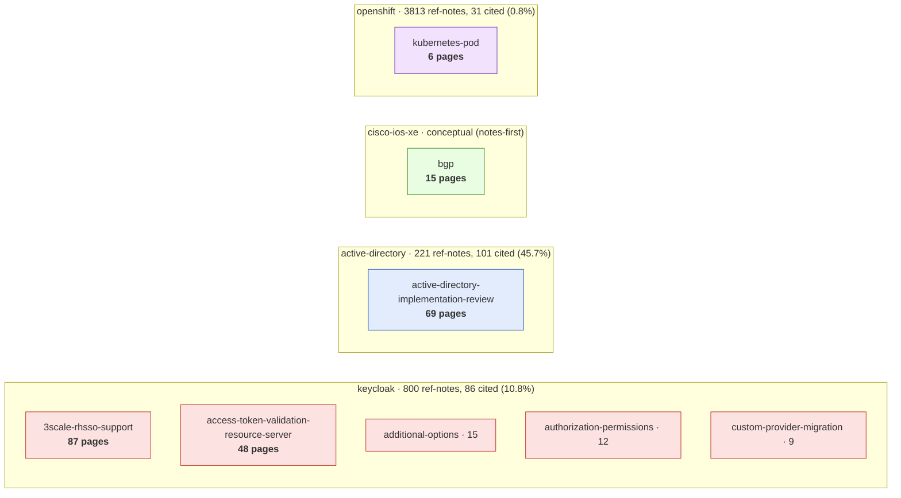
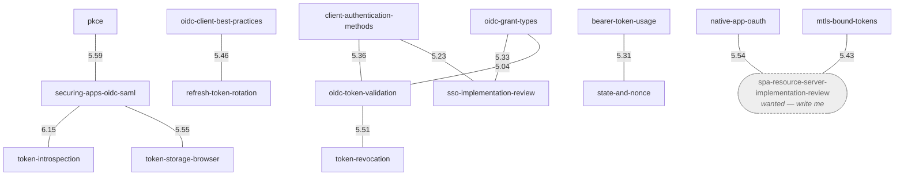
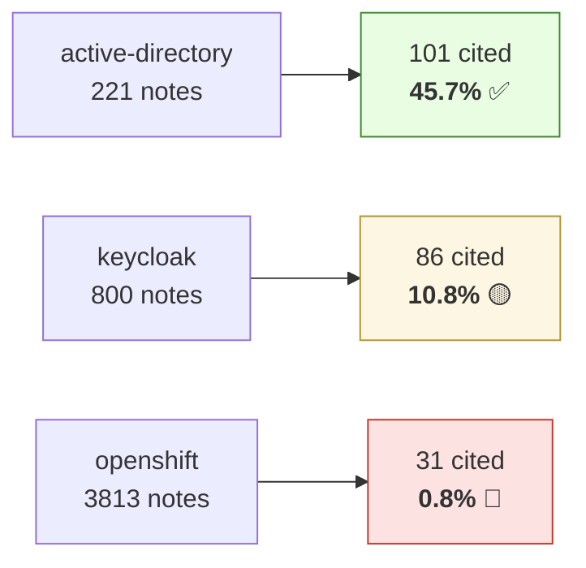

# Wiki Graph — Insight View

Visual companion to `python3 -m wikikb insights`. Hand-rendered (Opus 4.8) from the
deterministic `insights --json` snapshot — **261 pages · 1357 page↔page links**. Renders in
Obsidian and GitHub. Regenerate the numbers with `insights --json`; redraw when the shape shifts.

---

## 1. Community / domain map

Clusters from deterministic label propagation, sized by page count, grouped by `domain:`. Box = a
community's anchor page; `N pages` = community size. The four domains barely touch — the wiki is
four near-disjoint brains sharing one vault.

**Read:** keycloak dominates (5 communities, ~171 pages) and is well-cited; **openshift is the
gap** — 6 synthesis pages over a 3,813-note corpus (0.8% cited). That sparse OCP box is ROADMAP #1.

---

## 2. Suggested links — what the graph thinks *should* connect

Non-adjacent page pairs with high Adamic-Adar score (shared neighbors) that aren't linked yet. All
remaining suggestions sit inside the keycloak token/OIDC cluster. Each edge = a suggested link,
labelled with its score. `spa-resource-server-implementation-review` is a **wanted page** (dashed,
not yet written) —
two strong suggestions point at it, so it's the next page worth creating.

**Read:** `securing-apps-oidc-saml`, `oidc-token-validation`, and `client-authentication-methods`
are the hubs the graph wants more wired. Writing `spa-resource-server-implementation-review` would
absorb two of the strongest open suggestions.

---

## 3. Knowledge-gap ledger (synthesis ↔ corpus citation coverage)

Citation % = fraction of a domain's immutable `reference/<domain>/` corpus that at least one
synthesis page links. Low % = unused ground truth, i.e. the "what to write next" surface. openshift
is the headline gap (ROADMAP #1: recite the 6 synthesis pages against the corpus → `kb:` tokens →
`crosslink --apply` lights up CITES edges).
